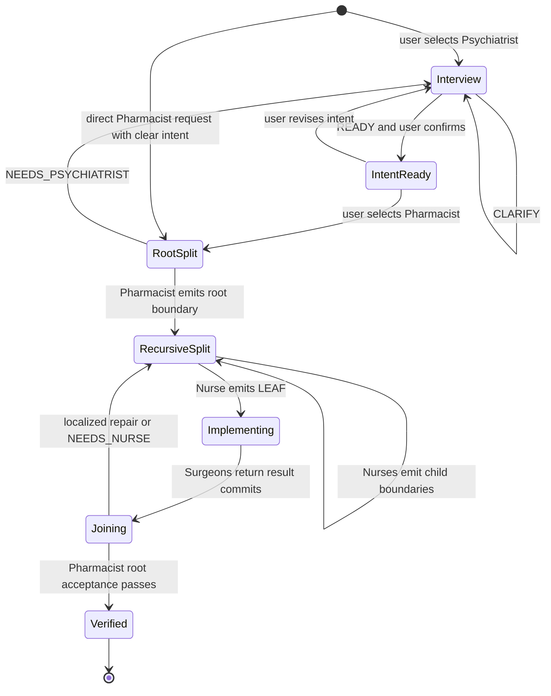
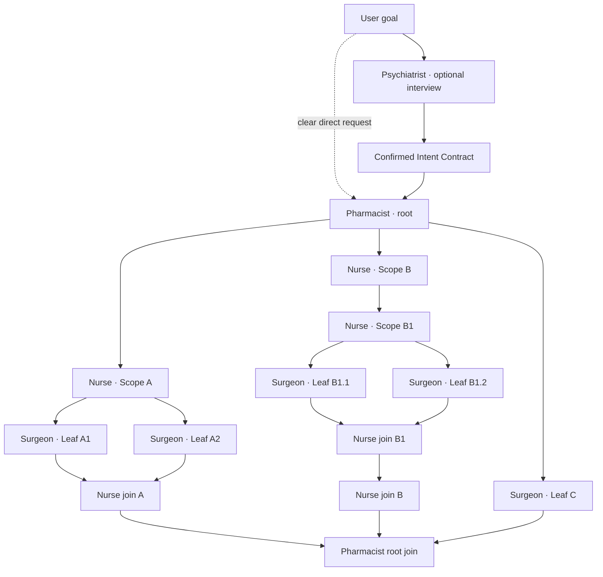
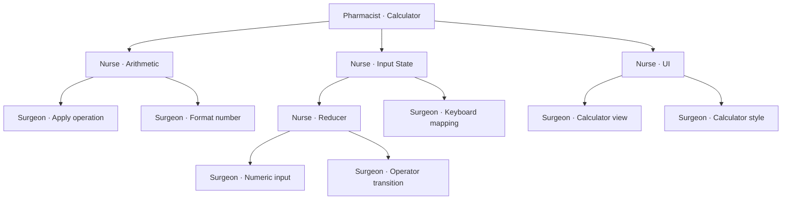

# Quackery Specification

**Status:** Draft 0.7

**Category:** Git-native recursive parallel implementation plugin for OpenCode

**Core statement:** Freeze the world. Fill one hole.

**Execution invariant:** One writer per path. One result commit per node.

## 1. Definition

Quackery는 OpenCode 안에서 동작하는 Git-native plugin이다. 하나의 coding agent가 전체 작업을 오래 계획하고 순차적으로 구현하는 대신, 작업을 실행 중에 재귀적으로 분해하고 먼저 원자화된 구현부터 즉시 병렬 실행한다.

사용자는 slash command를 호출하지 않는다. OpenCode에서 `Tab` 또는 `Shift+Tab`으로 **Psychiatrist** 또는 **Pharmacist** primary agent를 직접 선택한다. Psychiatrist는 사용자 의도를 명세하고, Pharmacist는 hidden Nurse와 Surgeon을 사용해 그 의도를 병렬 구현한다.

각 graph node는 한 가지 질문에 답한다.

```text
이 scope를 지금 구현할 수 있는가?

YES → Pharmacist/Nurse가 LEAF contract를 고정하고 Surgeon이 구현한다.
NO  → Pharmacist/Nurse가 독립적인 자식 scope와 그 사이 interface를 정의하고 동시에 실행한다.
```

그래프는 실행 전에 완성되지 않는다. Node가 분해될 때마다 아래로 확장된다. 먼저 leaf가 된 branch는 다른 branch의 분해가 끝날 때까지 기다리지 않는다.

각 sibling node는 동일한 parent boundary commit에서 갈라진 독립 Git worktree에서 실행된다. 공유 파일은 parent join이 소유하고, 같은 병렬 구간에서 하나의 tracked path에는 하나의 writer만 존재한다.

> Quackery는 Psychiatrist가 의도를 고정하고, Pharmacist가 최상위 경계를 만들며, Nurse가 각 branch를 재귀 분해하고, Surgeon이 먼저 원자화된 leaf부터 독립 worktree에서 즉시 구현하는 OpenCode fork-join plugin이다.

각 Surgeon은 자신을 제외한 나머지가 모두 구현되어 있다고 가정할 수 있는 **abstract-complete world**를 받는다. 이 world는 Surgeon이 구현할 하나의 exported interface와 이미 존재한다고 가정할 imported interface들로 구성된다. Surgeon은 dependency의 실제 구현을 기다리거나 조사하지 않고 자신의 implementation hole 하나만 채운다.

## 2. Problem

일반적인 agent harness는 복잡한 요청을 다음과 같이 처리한다.

```text
탐색
→ 전체 계획
→ 작업 위임
→ 결과 해석
→ 계획 수정
→ 재위임
```

이 구조에서는 동일한 요구사항이 planner, orchestrator, worker와 reviewer에게 반복 해석된다. 강한 모델이 구현 세부사항까지 계속 판단하고, dependency는 실제 필요 이상으로 실행 순서를 직렬화한다.

Quackery는 dependency의 구현을 기다리지 않는다. Parent가 dependency의 interface를 먼저 정의하면 provider와 consumer는 동시에 구현될 수 있다.

```text
B가 A를 사용한다
≠
A 구현 후 B 구현

A의 interface가 정의된다
→ A와 B를 동시에 구현한다
→ parent에서 연결하고 검증한다
```

## 3. Goals

Quackery는 다음을 목표로 한다.

1. 첫 실행부터 요청을 여러 branch로 분기한다.
2. 분해 자체도 재귀적으로 병렬화한다.
3. 전체 schema나 전체 계획이 완성되기 전에 leaf 구현을 시작한다.
4. Dependency를 구현 순서가 아니라 interface로 표현한다.
5. Surgeon을 함수 구현기 수준으로 제한한다.
6. 구현의 대부분을 낮은 비용과 빠른 모델로 수행한다.
7. 실패를 해당 leaf 또는 subtree에 국소화한다.
8. Agent의 reasoning보다 graph 진행률과 검증 결과를 보여준다.
9. Git commit을 node의 입력과 출력 경계로 사용한다.
10. 병렬 node 사이의 tracked-file write ownership 충돌을 실행 전에 차단한다.
11. 구현 graph를 만들기 전에 사용자 의도, 성공 조건과 비범위를 명시적으로 고정한다.
12. 인터뷰, 최상위 분해, 재귀 분해와 구현의 책임을 서로 다른 agent role로 분리한다.
13. 각 Surgeon에게 하나의 export와 이미 완성됐다고 가정할 imports로 이루어진 abstract-complete world를 제공한다.
14. 각 split의 sibling subtree가 비슷한 예상 remaining depth와 critical-path work를 갖도록 균형 있게 분해한다.
15. 역할별 model quality ladder를 project-local policy로 설정하고 provider별 model ID는 local override로 분리한다.
16. 병렬 fan-out의 동일 역할 sibling이 stable parent-boundary prompt prefix를 공유해 provider prompt cache를 재사용할 수 있게 한다.

## 4. Non-goals

Quackery의 core는 다음을 목표로 하지 않는다.

- 하나의 orchestrator agent가 전체 실행을 계속 감독하는 것
- 한 agent가 전체 descendant graph를 미리 작성하는 것
- 전체 schema 작성 후 전체 구현을 시작하는 것
- Agent가 서로 자유 형식 메시지로 협상하는 것
- 규칙 기반 deterministic compiler가 의미적 분해를 결정하는 것
- 인간 개발팀의 역할과 회의를 흉내 내는 것
- Worker 수를 무조건 최대화하는 것
- 원인이 알려지지 않은 버그를 탐색하는 범용 debugging agent
- OpenCode를 대체하거나 확장하는 독립·커스텀 coding TUI를 만드는 것
- 최초 버전에서 다른 harness용 adapter나 standalone CLI를 제공하는 것
- Slash command를 Quackery의 기본 진입점으로 사용하는 것
- Bootstrap과 self-hosting 순서를 core execution semantics에 포함하는 것
- Target implementation의 formal correctness proof를 제공하는 것

Quackery의 최초이자 기준 제품 형태는 OpenCode plugin이다. 별도 CLI나 다른 host 지원은 core semantics가 검증된 뒤의 호환 계층이며 초기 스펙의 범위가 아니다.

## 5. OpenCode Primary Agents and Internal Roles

Quackery는 별도의 `Quackery` agent나 slash command를 등록하지 않는다. 사용자가 `Tab` 또는 `Shift+Tab`으로 직접 선택할 수 있는 visible primary agent는 정확히 **Psychiatrist**와 **Pharmacist** 두 개다. OpenCode가 primary agent 순환을 제공하므로 이 둘은 Build, Plan 등 다른 primary agent와 같은 수준에 놓인다. 기준 문서는 [OpenCode Agents](https://opencode.ai/docs/agents/)와 [OpenCode Plugins](https://opencode.ai/docs/plugins/)다.

```text
… ⇄ Psychiatrist ⇄ Pharmacist ⇄ …
        visible          visible
                            │
                            ├─ Nurse      hidden, internal
                            └─ Surgeon    hidden, internal
```

Psychiatrist와 Pharmacist는 서로를 감싼 facade가 아니다. Psychiatrist는 사용자 의도를 명세하는 독립 primary mode이고, Pharmacist는 그 의도를 실행 graph로 바꾸는 독립 primary mode다. Nurse와 Surgeon만 Pharmacist가 내부적으로 사용하는 subagent다.

### 5.1 Agent registration

| Role | OpenCode mode | Visibility | Cardinality | Responsibility |
|---|---|---|---:|---|
| Psychiatrist | `primary` | visible/selectable | 1 per user session | Deep interview와 Intent Contract |
| Pharmacist | `primary` | visible/selectable | 1 per run | 최상위 scope, WIT world, graph 실행과 root join |
| Nurse | `subagent` | hidden | 0..N concurrent | 중간 node의 재귀 분해와 local join 설계 |
| Surgeon | `subagent` | hidden | 1 per leaf | 소유 파일 구현, 검증과 result commit |

Nurse와 Surgeon은 `@` autocomplete에서 숨기며 Pharmacist runtime만 호출할 수 있다. Psychiatrist는 Nurse나 Surgeon을 호출할 수 없고 product source를 수정할 권한도 없다.

### 5.2 Psychiatrist: selectable interview mode

사용자가 Psychiatrist를 선택하면 구현이나 task decomposition이 아니라 의도 명세만 수행한다. Repository를 read-only로 살펴보고 다음 중 결과를 바꿀 수 있는 모호함만 질문한다.

- 사용자가 실제로 얻고 싶은 observable outcome
- In-scope와 out-of-scope
- 보존해야 할 기존 behavior와 compatibility
- 기술적·운영적 제약
- 성공을 판정할 acceptance evidence
- 답에 따라 interface나 file ownership이 달라지는 선택

질문 수를 늘리는 것이 deep interview가 아니다. 이미 repository와 요청에서 확인 가능한 사실을 다시 묻지 않고, 답이 결과나 graph 구조를 바꾸는 질문만 한다. 명확한 작은 요청은 질문 없이 Intent Contract를 제시할 수 있다.

Interview mechanics는 [OMO Prometheus](https://github.com/ajentik/omo/blob/dev/src/agents/prometheus/interview-mode.ts)의 adaptive interview, explore-before-ask와 clearance-check 원칙을 참고하되 Quackery의 책임 경계에 맞게 축소한다. OMO처럼 implementer가 판단할 일이 전혀 없는 상세 기술 계획을 만드는 것이 아니라, 이후 Pharmacist가 interface boundary를 결정하는 데 필요한 **intent만 decision-complete**하게 만든다.

Psychiatrist는 요청을 먼저 다음 깊이로 분류한다.

- `trivial`: repository 확인 뒤 inferred contract를 바로 제시하며 질문을 만들지 않는다.
- `focused`: 결과를 바꾸는 모호함 하나에 대해 작은 decision cluster만 묻는다.
- `complex`: evidence-backed 질문과 clearance check를 반복한다.

Refactor에서는 보존 behavior와 regression boundary, 새 feature에서는 minimum observable version과 explicit exclusion, bug fix에서는 reproduction과 regression proof, architecture/research에서는 work가 내려야 할 decision과 exit criterion에 집중한다. 이 분류는 인터뷰 깊이만 바꾸며 implementation graph를 미리 설계하지 않는다.

각 meaningful exchange 뒤 다음 clearance gate를 평가한다.

1. Core objective가 명확하다.
2. Observable outcome이 구체적이다.
3. In-scope와 out-of-scope가 scope drift를 막을 만큼 명확하다.
4. Compatibility와 hard constraint가 확인됐다.
5. Acceptance evidence가 executable하거나 객관적으로 inspectable하다.
6. Interface 또는 ownership boundary를 바꿀 unresolved question이 없다.

하나라도 통과하지 못하면 그 blocker만 `CLARIFY`한다. 모두 통과하면 상세 implementation plan이 아니라 Intent Contract를 `READY`로 제시한다. OMO의 Metis/Momus plan-review chain, single giant task plan과 technical approach clearance는 도입하지 않는다. 그것들은 강한 planner의 직렬 critical path를 다시 만들고 Pharmacist/Nurse의 local decomposition 책임을 침범하기 때문이다.

Psychiatrist는 다음 중 하나를 반환한다.

```text
CLARIFY → 사용자 답변이 필요하다
READY   → Intent Contract를 제시하고 사용자 확인을 기다린다
```

확인된 Intent Contract는 plugin-owned state에 revisioned artifact로 저장된다. Psychiatrist가 Pharmacist를 자동 호출하거나 mode를 강제로 전환하지 않는다. 사용자가 `Tab` 또는 `Shift+Tab`으로 Pharmacist를 직접 선택한다.

### 5.3 Pharmacist: selectable execution mode

Pharmacist는 사용자-facing execution agent이자 유일한 root decomposer다. 선택되면 현재 repository와 session에 연결된 최신 confirmed Intent Contract를 우선 사용한다. Contract가 없다면 명확한 요청에 한해 최소 Intent Contract를 고정할 수 있지만, 결과를 바꿀 모호함이 남아 있으면 인터뷰를 흉내 내지 않고 `NEEDS_PSYCHIATRIST`를 반환한다.

Pharmacist는 전체 descendant plan을 만들지 않고 다음만 정의한다.

1. 예상 remaining depth가 균형 잡힌 최상위 child scope
2. Immediate child가 export할 interface와 import할 WIT world
3. Child subtree별 path ownership
4. Root acceptance obligation과 join-owned files
5. Root boundary commit

원자적인 요청이라 병렬화 이득이 없으면 하나의 LEAF를 Surgeon에게 직접 보낼 수 있다. 둘 이상의 child를 만든 경우에는 모두 즉시 실행한다. 이후의 중간 분해는 직접 수행하지 않고 Nurse에게 넘기며, leaf 구현은 Surgeon에게만 맡긴다.

Pharmacist가 모든 descendant leaf와 contract를 직접 열거해서는 안 된다. 그렇게 하면 전체 분해가 Pharmacist의 직렬 critical path가 되어 기존 중앙 orchestrator와 동일해진다. Pharmacist는 root의 immediate children만 만들고 나머지 graph 성장은 병렬 Nurse들에게 넘긴다. Root children은 가능한 한 비슷한 예상 remaining decomposition depth와 critical-path work를 가져야 한다.

### 5.4 Nurse: Pharmacist-internal recursive decomposer

Nurse는 Pharmacist 또는 다른 Nurse가 만든 non-leaf node를 받는다. 자신의 immediate children만 정의하며 inherited Intent Contract, WIT world와 ownership을 변경할 수 없다. Split할 때는 한 branch에 descendant decomposition이 몰리지 않도록 immediate child별 예상 remaining depth와 work를 함께 추정하고 균형 잡힌 경계를 선택한다.

```text
현재 scope가 원자적이다   → LEAF contract를 Surgeon에게 전달
아직 크다                → immediate children, local WIT worlds와 ownership을 정의하고 SPLIT
안전하게 나눌 수 없다    → REFUSE 또는 structured contract failure
```

여러 Nurse는 서로 다른 branch에서 동시에 실행될 수 있다. Nurse는 product code를 구현하지 않는다.

Nurse의 재귀성은 graph 표현을 위한 장식이 아니다. 서로 다른 branch의 Nurse가 동시에 local decomposition을 수행하게 해 분해 자체의 직렬 barrier를 제거한다. 먼저 abstract-complete world가 만들어진 branch는 다른 Nurse가 아직 분해 중이어도 Surgeon을 즉시 시작한다.

### 5.5 Surgeon: Pharmacist-internal leaf implementer

Surgeon은 하나의 LEAF contract와 전용 worktree를 받아 소유 파일만 구현한다. 다른 agent를 생성하거나 scope를 재설계할 수 없다. Scope가 실제로 원자적이지 않으면 억지로 구현하지 않고 `NEEDS_NURSE`를 반환한다.

### 5.6 Mode transition and runtime



Psychiatrist와 Pharmacist는 같은 OpenCode conversation history와 plugin-owned Intent Contract를 공유하지만 서로 다른 permission과 system prompt를 가진다. Nurse와 Surgeon은 Pharmacist의 child session에서 실행되며 각 implementation session의 working directory는 해당 node 전용 Git worktree다. Node와 phase 상태는 conversation transcript가 아니라 plugin-owned run state에 저장한다.

Plugin은 OpenCode hook을 사용해 edit/write 계열 tool 호출 전 경로 권한을 검사하고, tool 호출 후와 node 종료 시 Git diff를 다시 검사한다. Shell command처럼 사전 경로 판별이 불가능한 실행은 사후 diff audit를 통과해야 한다. 소유하지 않은 tracked path가 변경되면 해당 node의 결과는 merge되지 않는다.

OpenCode plugin API 변경은 host adapter 내부에서 흡수한다. Graph, interface, ownership과 join semantics가 OpenCode API shape에 직접 의존해서는 안 된다. V2가 안정화되기 전까지 adapter compatibility는 명시적으로 version pin하고 검증한다.

## 6. Execution Graph

Quackery graph는 실행 전에 만들어진 정적 task list가 아니다. Confirmed Intent Contract를 받은 Pharmacist root에서 시작해 Nurse의 판단에 따라 실행 중에 성장한다.



### 6.1 Pharmacist root

Pharmacist는 전체 구현 계획을 만들지 않는다. Root 책임은 다음으로 제한된다.

1. 최상위 child scope 정의
2. Immediate child별 WIT import/export world 정의
3. Child별 acceptance obligation 정의
4. Root join verification 정의

Pharmacist가 자식을 반환하면 runtime은 모든 자식을 즉시 병렬 실행해야 한다. LEAF child는 Surgeon에게, 더 분해해야 하는 child는 Nurse에게 전달한다.

### 6.2 Nurse recursive decomposition

각 non-leaf child는 Nurse에게 전달된다. Nurse는 현재 scope가 너무 크면 자신의 immediate children과 그 사이 WIT worlds만 정의한다. Child 수를 맞추는 것이 아니라 예상 remaining depth와 critical-path work를 비슷하게 만드는 split을 선택한다.

```typescript
async function executeNode(node: Node): Promise<SubtreeResult> {
  if (node.kind === "leaf") {
    return runSurgeon(node);
  }

  const result = await runNurse(node);

  if (result.kind === "refuse") {
    return failed(result.reason);
  }

  if (result.kind === "leaf") {
    return runSurgeon(result);
  }

  const boundary = await commitBoundary(result);
  await reserveOwnership(boundary, result.children);

  const children = await Promise.all(
    result.children.map(async (child) => {
      const worktree = await createWorktree(boundary, child);
      return executeNode({ ...child, worktree });
    }),
  );

  return joinAndVerify(boundary, children);
}
```

Pharmacist가 시작하고 Nurse가 재귀 확장하며 Surgeon이 leaf를 닫는다. `Promise.all`에 해당하는 recursive fan-out과 그 뒤의 join이 Quackery의 핵심 실행 의미다.

### 6.3 No global barrier

Quackery는 모든 branch의 분해가 완료될 때까지 implementation을 막아서는 안 된다. Psychiatrist의 Intent Contract는 실행 전 의도 경계이지 전체 graph plan이 아니다. Pharmacist가 실행을 시작한 뒤에는 global planning barrier가 존재하지 않는다.

```text
t0  Pharmacist root 실행

t1  Nurse A, Nurse B, Surgeon C 동시 실행

t2  Nurse A가 A1과 A2 Surgeon 실행
    Nurse B는 B1과 B2로 추가 분해
    Surgeon C는 이미 구현 중

t3  Surgeon A1, A2, C 구현 계속
    B1 Surgeon 구현 시작
    B2 Nurse 추가 분해
```

먼저 원자화된 branch가 먼저 구현된다.

### 6.4 Execution tree and world wiring graph

Quackery는 서로 다른 의미의 edge를 하나의 scheduling graph로 섞지 않는다.

```text
Execution tree
parent → immediate child
의미: recursive fork와 join

World wiring graph
export → matching import
의미: abstract world composition, 대기 없음
```

`B imports A`는 실행 순서가 아니다. A와 B는 같은 boundary commit에서 동시에 실행한다. Runtime을 직렬화하는 edge는 interface와 stub으로 바꿀 수 없는 explicit completion dependency뿐이다.

각 split은 sibling별 `estimated_remaining_depth`와 `estimated_work`를 기록한다. Runtime은 최대·최소 예상 depth 차이와 work skew를 계산해 설정된 balance limit을 넘는 split을 거부하거나 structured imbalance justification을 요구한다. 실제 graph가 닫힌 뒤에는 예상치와 실제 depth를 비교해 decomposer routing을 평가한다.

## 7. Intent and Node Protocol

### 7.1 Intent Contract

Psychiatrist가 만드는 handoff artifact는 prose plan이 아니라 versioned Intent Contract다.

```yaml
kind: intent
revision: intent-03
repository_base: 7d5f2b1

goal: "브라우저에서 동작하는 사칙연산 계산기"
observable_outcomes:
  - "숫자와 연산자를 눌러 결과를 볼 수 있다"
  - "0으로 나누면 명시적인 오류 상태를 표시한다"

in_scope:
  - arithmetic behavior
  - keyboard and button input
  - calculator UI

out_of_scope:
  - calculation history
  - scientific functions

constraints:
  - existing framework and package manager 유지
  - new runtime dependency 금지

acceptance:
  - unit tests for four operators and division by zero
  - repository type-check and build

assumptions: []
open_questions: []
confirmed_by_user: true
```

Intent Contract에는 구현 파일, child node나 graph 구조를 적지 않는다. 그것은 Pharmacist의 책임이다. `open_questions`가 비어 있지 않거나 사용자 확인이 없으면 Pharmacist workflow의 실행 입력으로 사용할 수 없다. Pharmacist가 명확한 direct request에서 만든 최소 Intent Contract는 `source: pharmacist-direct`를 기록한다.

모든 graph node는 동일한 `intent_revision`에 pin된다. 사용자가 의도를 수정하면 영향받는 subtree만 새 revision으로 재분해하고, 이전 revision의 결과를 자동 재사용하지 않는다.

### 7.2 Graph node input

각 node는 다음 입력을 받는다.

```text
scope
intent revision
parent가 정의한 inherited WIT world
base commit과 node worktree
제한된 repository context
허용된 effect
예약된 path ownership
acceptance obligation
```

Pharmacist와 Nurse의 decomposition call은 세 결과 중 정확히 하나를 반환한다. Surgeon은 이 protocol의 decision maker가 아니라 LEAF consumer다.

### 7.3 SPLIT

현재 scope를 둘 이상의 독립 자식으로 나눈다.

```yaml
kind: split
node: calculator
producer: pharmacist
intent_revision: intent-03

children:
  - id: arithmetic
    exports: [arithmetic]
    imports: []
    world: contracts/calculator.wit#arithmetic-surgeon
    estimated_remaining_depth: 1
    estimated_work: 2
    owns:
      - src/calculator/arithmetic/

  - id: input-machine
    exports: [input-machine]
    imports: [arithmetic]
    world: contracts/calculator.wit#input-surgeon
    estimated_remaining_depth: 2
    estimated_work: 3
    owns:
      - src/calculator/input/

  - id: calculator-view
    exports: [calculator-view]
    imports: [input-machine]
    world: contracts/calculator.wit#view-surgeon
    estimated_remaining_depth: 1
    estimated_work: 2
    owns:
      - src/calculator/ui/

worlds:
  wit: contracts/calculator.wit
  behavior: contracts/calculator.behavior.md
  binding: contracts/calculator.quackery.yml

join:
  integration:
    id: calculator-integration
    kind: leaf
    exports: [calculator]
    imports: [arithmetic, input-machine, calculator-view]
    world: contracts/calculator.wit#calculator-integration
    estimated_remaining_depth: 0
    estimated_work: 1
    owns:
      - src/calculator/index.ts
  verify:
    - pnpm vitest run
    - pnpm build
```

SPLIT은 다음 조건을 만족해야 한다.

- 각 child scope가 명시되어야 한다.
- Sibling dependency는 parent-owned WIT import/export로 표현되어야 한다.
- Child subtree 전체의 path ownership이 예약되어야 하며 sibling끼리 겹치면 안 된다.
- Parent-owned interface와 join file은 child ownership에 포함되면 안 된다.
- Parent obligation은 child 또는 join에 빠짐없이 할당되어야 한다.
- 하나의 child만 생성해서는 안 된다. 이 경우 현재 node를 leaf로 유지한다.
- 각 child는 예상 remaining depth와 work를 가져야 하며 sibling 사이의 불균형이 설정된 한계를 넘으면 repartition하거나 불가피한 이유를 기록해야 한다.

### 7.4 LEAF

현재 scope가 하나의 Surgeon에게 전달 가능한 상태다.

```yaml
kind: leaf
id: arithmetic.apply
producer: nurse
executor: surgeon
intent_revision: intent-03
world: contracts/calculator.wit#arithmetic-surgeon
behavior: contracts/calculator.behavior.md#arithmetic-apply
base_commit: 7d5f2b1
world_revision: 193a0d8

reads:
  - src/calculator/contracts.ts

owns:
  - src/calculator/arithmetic.ts
  - src/calculator/arithmetic.test.ts

verify:
  - pnpm vitest run src/calculator/arithmetic.test.ts
  - pnpm tsc --noEmit

constraints:
  new_dependencies: false
  public_contract_changes: false
```

`base_commit`, `world_revision`과 실제 worktree 경로는 worker가 작성하지 않고 runtime이 주입한다.

LEAF는 다음 조건을 만족해야 한다.

- WIT export에 input, output과 error surface가 명확하다.
- 모든 dependency가 WIT import와 stub으로 제공된다.
- Natural-language contract가 observable behavior와 effect를 명확히 한다.
- 독립적인 write ownership이 존재한다.
- 실행 가능한 verification command가 있다.
- Worker가 새로운 architecture 결정을 내릴 필요가 없다.

### 7.5 REFUSE

현재 정보로 안전한 split이나 leaf contract를 만들 수 없을 때 반환한다.

```yaml
kind: refuse
reason: ambiguous-boundary
detail: "인증 상태의 소유자가 repository에서 확인되지 않음"
```

REFUSE는 장시간 추측하는 것보다 우선한다.

## 8. Interface-first Parallelism

Sibling dependency의 interface는 provider나 consumer가 아니라 두 child를 만든 parent가 소유한다.

```text
Parent defines I
├─ Provider implements I
└─ Consumer assumes I
```

Child는 inherited WIT world를 임의로 변경할 수 없다.

Dependency는 두 종류로 구분한다.

### Contract dependency

```text
InputMachine --requires--> Arithmetic
```

Consumer는 generated stub 또는 mock을 사용하므로 provider implementation 완료를 기다리지 않는다.

### Completion dependency

실제 artifact가 없으면 다음 작업을 시작할 수 없는 관계다. Quackery는 가능한 completion dependency를 contract dependency로 바꿔야 한다. 정말 변환할 수 없는 경우에만 실행 순서 edge로 남긴다.

## 9. Abstract-Complete Worlds with WIT

Quackery는 dependency interface 문법을 새로 만들지 않는다. Parent는 [WebAssembly Interface Types](https://component-model.bytecodealliance.org/design/wit.html), 이하 WIT를 사용해 각 child가 제공할 export와 이미 구현됐다고 가정할 imports를 정의한다. WIT의 `world`가 하나의 Surgeon이 보는 abstract-complete world다.

WIT는 target product를 WebAssembly component로 만들기 위한 요구사항이 아니다. Quackery는 WIT의 language-neutral type, interface, import, export와 world model을 implementation boundary로 사용한다. Target repository binding과 실제 runtime ABI는 host language가 유지한다.

### 9.1 One world, one hole

각 Surgeon world는 정확히 하나의 implementation hole을 가진다.

```text
exports → Surgeon이 구현해야 하는 interface
imports → 이미 완성되어 있다고 가정하는 dependency interfaces
```

Surgeon은 import의 실제 source를 조사하거나 수정하거나 다시 구현해서는 안 된다. Import가 실제로 아직 구현 중이어도 Surgeon에게는 parent-provided stub 또는 fake로 완성된 것처럼 보인다.

```wit
package quackery:calculator@0.1.0;

interface arithmetic {
  enum operator { add, subtract, multiply, divide }
  variant calc-result { value(f64), division-by-zero }
  apply: func(lhs: f64, op: operator, rhs: f64) -> calc-result;
}

interface input-machine {
  record calculator-state { display: string }
  press: func(state: calculator-state, key: string) -> calculator-state;
}

world arithmetic-surgeon {
  export arithmetic;
}

world input-surgeon {
  import arithmetic;
  export input-machine;
}
```

`input-surgeon`에게 Arithmetic는 이미 존재한다. 해당 Surgeon은 `input-machine` export만 구현한다.

### 9.2 Natural-language behavior contract

WIT는 input, output, result variant와 import/export surface를 고정하지만 내부 behavior를 정의하지 않는다. Operation의 구체적인 조건은 짧은 natural-language contract로 제공한다.

```markdown
# arithmetic.apply

Inputs: lhs, operator, rhs as defined by the WIT interface.
Output: calc-result.

Behavior:
- add, subtract and multiply return the corresponding numeric result.
- divide returns division-by-zero when rhs is zero.
- otherwise divide returns lhs divided by rhs.

Effects: none.
Non-goals: formatting and input-state transitions.
```

Natural-language contract는 architecture를 다시 결정하는 prose plan이 아니다. WIT surface 안에서 observable behavior, error condition, effect와 non-goal만 설명한다. 모호해서 싼 Surgeon이 새로운 architecture 결정을 내려야 한다면 LEAF가 아니며 Nurse에게 되돌린다.

### 9.3 Boundary materialization

Split을 만든 Pharmacist 또는 Nurse는 child를 spawn하기 전에 boundary commit에 다음을 고정한다.

1. Sibling interfaces와 child별 WIT worlds
2. Natural-language behavior contracts
3. Target-language interface projection
4. Imported interface의 stub 또는 fake
5. World와 repository symbol의 binding metadata
6. Child ownership과 verification obligation

Target-language projection과 stub은 parent-owned boundary artifact다. Surgeon은 이를 변경하지 않는다. 지원되는 target에서는 generator를 사용할 수 있고, 그렇지 않으면 decomposer가 최소 projection을 작성하고 repository type-check로 검증한다.

### 9.4 Revision and invalidation

World revision은 WIT, behavior contract, binding과 stub을 포함하는 parent boundary commit으로 식별한다. 모든 child는 정확히 같은 boundary revision에서 시작한다. World가 변경되면 그 import 또는 export에 의존한 descendant 결과는 재사용하지 않는다.

Dependency edge는 기본적으로 scheduling edge가 아니다. `B imports A`는 B가 A 구현을 기다린다는 뜻이 아니라 B의 abstract world에 A가 이미 제공되어 있다는 뜻이다. 실제 artifact 없이는 stub조차 만들 수 없는 경우에만 explicit completion dependency를 사용한다.

### 9.5 Pre-spawn validation

Runtime은 child를 시작하기 전에 다음을 확인한다.

1. WIT syntax와 world별 import/export resolution
2. 각 Surgeon world에 정확히 하나의 export가 존재함
3. 모든 import에 interface와 stub 또는 fake가 존재함
4. Target-language interface projection이 type-check됨
5. Sibling ownership이 겹치지 않음
6. 각 export에 natural-language behavior contract와 실행 가능한 verification이 있음

이 검사가 통과한 boundary commit이 각 cheap Surgeon에게 제공되는 완성된 추상 세계다.

## 10. Surgeon

Surgeon은 함수 구현기다.

```text
contract 읽기
→ 제한된 repository context 읽기
→ 소유 파일 구현
→ verification 실행
→ result commit과 evidence 반환
```

Surgeon은 다음을 수행해서는 안 된다.

- 전체 feature 재설계
- 새로운 child agent 생성
- Sibling worker와 대화
- Inherited interface 변경
- 소유하지 않은 파일 수정
- 검증 실패를 성공으로 보고

Psychiatrist와 Pharmacist에는 높은 의도 해석 및 구조화 능력을 가진 모델을 사용한다. Nurse는 국소 분해에 충분한 중간 모델, Surgeon은 낮은 비용과 빠른 구현 모델을 기본으로 한다. 실제 routing은 역할 이름이 아니라 benchmark profile로 설정한다.

### 10.1 Model quality ladder

Quackery는 provider model 이름을 역할 prompt에 직접 박지 않는다. `.quack`의 네 단계 quality ladder가 실제 model과 variant를 가리키고, profile이 역할을 tier에 배치한다.

| Profile | Psychiatrist | Pharmacist | Nurse | Surgeon |
|---|---|---|---|---|
| `quality` | frontier | frontier | strong | balanced |
| `balanced` | frontier | strong | balanced | economy |

`quality`는 분해 품질을 우선하고 `balanced`는 구현 fan-out 비용을 더 낮춘다. 어느 profile에서도 Psychiatrist는 frontier에 고정한다. 같은 역할의 sibling cohort는 cache 재사용을 위해 동일 model과 variant를 사용한다. 실패한 leaf를 승격하더라도 sibling 전체가 아니라 해당 leaf만 승격하며, 승격된 호출은 별도 cache partition으로 취급한다.

Project는 tier와 role 정책만 공유하고 실제 provider/model ID는 개인별 `.quack/config.local.jsonc`에서 설정할 수 있다. Tier가 mapping되지 않았으면 Quackery는 OpenCode의 기존 role model 또는 현재 model을 그대로 상속한다. 즉 provider 선택권을 빼앗지 않으면서 역할별 비용 구조만 명시한다.

## 11. Git Isolation and Ownership

Git은 결과 저장 수단이 아니라 Quackery의 isolation, provenance, rollback과 recursive join substrate다. Node의 입력은 commit이고 출력도 commit이다.

### 11.1 Run preflight

Quackery v0.1은 Git repository에서만 실행한다.

```text
git repository 확인
→ invocation branch와 base commit 기록
→ working tree cleanliness 확인
→ isolated root worktree와 run branch 생성
→ Pharmacist root 실행
```

기본 모드에서는 tracked file, staged change와 untracked file을 포함해 invocation worktree가 clean해야 한다. Dirty worktree를 자동 stash, reset 또는 임의 commit하지 않는다. 이후 명시적인 snapshot mode를 제공할 수 있지만 v0.1은 이유와 변경 목록을 보여주고 REFUSE한다.

Quackery는 실행 중 사용자의 원래 checkout을 수정하지 않는다. 성공한 root result는 별도 run branch와 commit으로 남기고 사용자가 apply를 승인할 때 invocation branch에 적용한다. 원래 branch가 base에서 이동했거나 dirty해졌다면 자동 적용하지 않고 result commit을 보존한다.

### 11.2 Worktree topology

Split node는 WIT worlds, behavior contract, binding, stubs와 child manifest를 자신의 **boundary commit**으로 먼저 고정한다. 모든 immediate child는 이 commit에서 branch되며 각자 독립 worktree와 OpenCode session을 가진다.

```text
parent base commit
└─ parent boundary commit
   ├─ child A branch/worktree → child A result commit
   ├─ child B branch/worktree → child B result commit
   └─ child C branch/worktree → child C result commit
                              ↓
                    parent integration commit
```

Child가 다시 split하면 같은 규칙을 자신의 subtree에서 반복한다. Leaf는 검증된 변경을 하나의 node result commit으로 반환한다. 내부 시도 commit이 여러 개여도 parent가 소비하는 경계는 `base_commit`, `world_revision`, `head_commit` 세 값이다.

### 11.3 One writer per path

Parallel implementation의 최소 안전 조건은 **one writer per path per parallel epoch**다.

1. 모든 child subtree는 spawn 전에 tracked path ownership을 예약한다.
2. 동시에 실행되는 sibling의 ownership은 exact path와 directory prefix 기준으로 겹치면 안 된다.
3. 기존 파일은 exact path로, 새 파일 영역은 제한된 directory prefix로 예약하는 것을 기본으로 한다.
4. Rename은 source와 destination 모두, delete는 삭제되는 path의 ownership을 요구한다.
5. `reads`는 context 제한일 뿐 exclusive lock이 아니다. 여러 worker가 같은 파일을 읽을 수 있지만 쓸 수 있는 worker는 하나뿐이다.
6. Child가 더 분해되면 자신의 ownership 일부를 descendant에게 재할당할 수 있지만 sibling subtree의 영역을 가져올 수 없다.

Ownership이 겹치는 split은 실행하지 않는다. Decomposition node는 다음 중 하나를 선택해야 한다.

- 겹치는 child를 하나의 node로 합친다.
- 공유 path를 정확히 하나의 child에 할당하고 다른 child는 WIT import와 stub에만 의존한다.
- 공유 path를 parent join이 소유한다.
- 병렬화할 수 없는 변경만 explicit completion dependency로 직렬화한다.

공유 registry, barrel export, route table, migration index, dependency manifest, lockfile과 최종 wiring file은 기본적으로 parent join이 소유한다. Child가 새 dependency를 필요로 하면 manifest를 직접 수정하지 않고 structured dependency request를 반환하며 parent가 한 번만 반영한다.

### 11.4 Runtime enforcement

Ownership은 prompt convention이 아니라 runtime invariant다.

```text
spawn 전     ownership reservation 충돌 검사
tool 실행 전  edit/write 대상 경로 검사
tool 실행 후  git diff로 unowned write 검사
node 종료 시  base..head changed-path 전체 검사
join 전       commit, WIT world revision과 ownership 재검사
```

Shell, formatter, code generator 또는 test command가 소유하지 않은 tracked file을 수정하면 node를 즉시 실패 처리하고 그 commit을 merge하지 않는다. 해당 worktree는 evidence를 위해 보존할 수 있지만 sibling이나 user checkout에는 영향이 없다. Ignored build output과 runtime scratch는 patch ownership 대상이 아니며 result commit에 포함될 수 없다.

### 11.5 Recovery and cleanup

Quackery는 user branch에 force push, hard reset 또는 implicit stash를 수행하지 않는다. 실패한 subtree의 branch와 last commit은 run metadata에 기록한다. 성공한 join과 사용자가 적용한 result만 확인한 뒤 임시 worktree를 정리한다. Cleanup 실패는 구현 성공과 구분해 보고하며 recoverable branch를 먼저 보존한다.

### 11.6 `.quack` project policy and runtime state

Repository-local Quackery configuration은 `.quack/`에 둔다.

```text
.quack/
├─ config.jsonc                tracked project policy
├─ config.local.jsonc          ignored provider/model override
└─ config.local.example.jsonc  tracked setup example
```

설정 우선순위는 plugin options, tracked `config.jsonc`, ignored `config.local.jsonc` 순이며 뒤의 값이 앞의 값을 override한다. Project profile, balance threshold, execution limit과 cache policy는 tracked config에 둘 수 있다. Secret, provider credential과 machine-specific runtime path는 넣지 않는다.

실행 중 변경되는 graph snapshot, session ID, branch와 recoverable commit은 `.quack/`에 쓰지 않고 Git metadata 아래 `.git/quackery/runs/`에 저장한다. Temporary child worktree는 OS temporary directory를 사용한다. 따라서 project policy와 ephemeral execution state가 섞이지 않고, child commit에 runtime state가 우연히 포함되지 않는다.

### 11.7 Parent-boundary prompt cache

Prompt cache는 병렬성을 위한 barrier가 아니다. Parent가 immediate child world를 boundary commit으로 고정한 직후 child를 그대로 fan-out하며, 같은 parent 아래 같은 역할이 `cache.minFanout` 이상일 때만 cache cohort를 만든다.

Cache prefix에는 다음처럼 sibling에게 실제로 공통인 정적 정보만 포함한다.

- cache protocol version과 role
- parent node ID와 scope
- frozen boundary commit
- 정렬된 immediate child WIT interface summary

실행 중인 child의 node ID, session ID, worktree 절대경로, timestamp와 leaf별 구현 지시는 공통 prefix에 넣지 않는다. Node별 prompt는 이 stable prefix 뒤에 배치한다. Nurse와 Surgeon, 서로 다른 parent boundary, 서로 다른 model/variant는 cache partition을 공유하지 않는다.

Provider cache는 최적화이며 correctness 조건이 아니다. Cache miss가 나도 실행 결과는 동일해야 한다. Runtime은 node별 input/output/reasoning token, cache read/write token과 cost를 수집해 text graph에 표시한다. `promptCacheKey`를 지원하는 provider에는 cohort key를 전달하지만 실제 hit 여부는 provider 응답 telemetry로만 판정한다. Cache warm-up을 기다리는 global primer나 sibling barrier는 만들지 않는다.

## 12. Recursive Join

Split을 만든 Nurse는 모든 child subtree가 끝나면 local join을 실행한다. 최상위 child가 모두 끝나면 Pharmacist가 root join을 실행한다.

```text
child evidence 확인
→ changed-path ownership 확인
→ child result commit 합성
→ parent contract test 실행
→ integration verification 실행
→ subtree result commit 또는 failure 반환
```

Join은 agent의 reasoning transcript를 읽지 않는다. 다음 artifact만 사용한다.

- Contract version
- Base, boundary와 result commit
- Changed file list
- Verification command와 exit status
- Structured failure evidence

Parent는 sibling result를 stable node order로 integration worktree에 적용한다. Semantic merge 판단은 하지 않으며 ownership invariant상 sibling content conflict가 없어야 한다. Conflict가 발생하면 곧바로 join failure이며 agent가 임의로 양쪽 코드를 섞지 않는다.

Parent join이 소유한 wiring 또는 registry file에 product-code 변경이 필요하면 Nurse나 Pharmacist가 직접 구현하지 않는다. Child result를 합성한 뒤 join-owned world 하나를 Integration LEAF로 만들고 Surgeon이 그 구멍만 구현한다. 이는 실제 child artifact가 필요한 명시적 completion dependency이며 recursive parallel 구간이 닫힌 뒤에만 실행된다.

Root join은 invocation base에 대한 전체 product diff를 하나의 root result commit으로 정규화한다. Internal boundary와 retry commit은 run provenance에는 남지만 사용자에게 적용 대상으로 제시하는 공개 경계는 이 root result commit 하나다.

Pharmacist root join이 성공해야 전체 요청이 완료된다.

## 13. Failure Handling

### Surgeon implementation failure

해당 leaf만 제한된 횟수로 재시도하거나 더 높은 모델로 승격한다. Sibling subtree는 재실행하지 않는다.

### NEEDS_NURSE

Surgeon이 받은 LEAF가 실제로 원자적이지 않으면 해당 node만 Nurse decomposition 상태로 되돌린다.

```yaml
kind: needs-nurse
reason: "상태 전이와 persistence가 현재 scope에서 과도하게 결합됨"
```

### Contract failure

Inherited WIT world 또는 behavior contract가 구현 불가능하거나 필요한 의미를 표현하지 못할 때 structured evidence를 parent로 반환한다.

```yaml
kind: contract-failure
contract: session-store
reason: missing-effect
evidence:
  - "session 생성은 last-login-at 갱신과 atomic해야 함"
```

Parent가 WIT world나 behavior contract를 수정하면 해당 revision에 의존한 descendant만 무효화한다.

### Join failure

개별 child는 통과했지만 parent integration이 실패한 경우다. Parent는 관련 child만 repair하거나, WIT world를 수정하거나, 강하게 결합된 child를 하나의 node로 다시 합칠 수 있다.

전체 graph의 무조건적인 재계획은 허용하지 않는다.

### Execution bounds

모든 run은 다음 상한을 가져야 한다.

- 최대 graph depth
- 최대 node 수
- Node별 retry와 timeout
- Model별 token 또는 비용 budget
- 전체 run timeout

상한에 도달하면 Quackery는 계속 생각하지 않고 미완료 graph와 실패 이유를 반환한다.

## 14. Calculator Scenario

사용자는 `Shift+Tab`으로 Psychiatrist를 선택하고 요청한다.

```text
PSYCHIATRIST
> 계산기 만들어줘
```

Psychiatrist는 repository를 확인한 뒤 결과를 바꾸는 질문만 한다.

```text
Psychiatrist: 브라우저 UI인가, CLI인가?
User: 지금 React 앱 안의 브라우저 UI.

Psychiatrist: 히스토리나 과학 계산 기능도 필요한가?
User: 아니. 사칙연산과 0 나누기 오류까지만.
```

확인된 Intent Contract가 저장되면 사용자가 `Shift+Tab`으로 Pharmacist를 선택한다.

```text
PHARMACIST
> 이 의도대로 구현해줘
```

Pharmacist는 다음 최상위 경계만 정의한다.

```text
Calculator
├─ Arithmetic
├─ Input State
└─ UI

Arithmetic.apply(lhs, operator, rhs) → CalcResult
InputMachine.press(state, key) → CalculatorState
CalculatorView.render(state) → UI
```

실행 중 graph는 다음처럼 성장한다.



실행 시간축:

```text
t0  Pharmacist가 Intent Contract와 repository base를 고정

t1  Pharmacist가 child별 WIT world와 root boundary commit 생성
    Arithmetic Nurse, Input State Nurse, UI Nurse 동시 실행

t2  Arithmetic Nurse가 두 Surgeon 실행
    Input State Nurse는 Reducer Nurse와 Keyboard Surgeon 실행
    UI Nurse가 두 Surgeon 실행

t3  Reducer Nurse가 Numeric input과 Operator transition Surgeon 실행
    앞서 시작한 Surgeon들은 계속 구현 중

t4  각 Nurse local join
    Pharmacist calculator root join
```

UI Surgeon은 InputMachine 구현 완료를 기다리지 않는다. Pharmacist가 정의한 interface와 stub을 사용한다. Input State Surgeon 역시 Arithmetic 구현 완료를 기다리지 않는다.

각 branch는 서로 다른 worktree에서 같은 root boundary commit을 상속한다. `src/calculator/index.ts` 같은 최종 wiring file은 어느 parallel child도 수정하지 않는다. Child 결과가 합성된 뒤 root join이 Integration LEAF를 만들고 Surgeon이 한 번만 작성한다.

## 15. User Experience

Psychiatrist와 Pharmacist는 OpenCode의 일반 primary agent처럼 선택한다.

```text
[Shift+Tab]
PSYCHIATRIST
Intent · Calculator
✓ outcome defined
✓ scope bounded
✓ acceptance defined
Ready for Pharmacist

[Shift+Tab]
PHARMACIST
> 구현해줘
```

Quackery는 별도의 status panel, graph widget, 버튼 또는 다른 custom TUI surface를 만들지 않는다. 실행 관찰에는 OpenCode가 기본 제공하는 conversation transcript와 parent/child session navigation을 그대로 사용한다. Plugin-owned graph state는 계속 유지하며 Pharmacist는 의미 있는 phase transition, 사용자 요청과 완료 시점에 일반 assistant message로 compact text tree, node count, verification과 failure를 보고한다. 장문의 reasoning이나 agent 간 자유 형식 대화는 사용자에게 중계하지 않는다.

완료 응답에는 root result commit, 실행한 verification과 성공·실패·미검증 경계를 일반 text로 제시한다. 사용자가 conversation에서 apply를 승인하면 invocation branch가 안전한지 다시 확인한 뒤 result commit을 반영한다. 안전하지 않으면 branch와 commit을 보존하고 사용자가 직접 검토할 수 있는 명령을 보여준다.

### 15.1 Brand tone

Quackery라는 이름은 agent 의료진을 향한 self-deprecating joke이지 결과의 정확성을 가볍게 취급한다는 선언이 아니다. Product copy는 수상한 의료진과 엄격한 runtime의 대비를 유지한다.

Primary brand line:

> **Medically paralyzed. Computationally parallelized.**

`paralyzed / parallelized`는 의료 세계관과 parallel execution의 발음을 이용한 wordplay일 뿐이다. Runtime state, contract semantics 또는 별도의 design principle을 뜻하지 않으며 protocol terminology에는 사용하지 않는다.

Secondary line:

> Questionable medicine. Verified commits.

Mascot 방향은 **귀여운 오리 의사**다. Psychiatrist, Pharmacist, Nurse와 Surgeon은 같은 duck visual family 안에서 소품과 복장만 달리한다. Mascot은 project documentation과 배포 asset을 위한 brand 방향이며 v0.1 runtime이 OpenCode TUI에 mascot 또는 별도 visual surface를 렌더링하지 않는다. Product copy는 병원 행정 시스템처럼 건조하고 정확하게 유지하고 환자나 정신질환을 웃음의 대상으로 삼지 않는다.

## 16. Performance Metrics

Quackery는 agent 수가 아니라 critical path를 줄이는 것을 목표로 한다.

측정해야 할 핵심 지표는 다음과 같다.

- Psychiatrist interview turn과 wall-clock time
- `NEEDS_PSYCHIATRIST` rate
- 실행 시작 후 Intent Contract revision count
- Time to first Surgeon
- Time to first verified leaf commit
- 전체 wall-clock time
- Graph depth와 최대 parallel width
- Split별 estimated depth/work skew
- Sibling subtree의 실제 depth와 wall-clock skew
- Estimated remaining depth와 실제 depth의 오차
- Decomposition model token
- Implementation model token
- Strong-model token share
- Parent-boundary cache-eligible cohort count
- Cache read/write token과 cache hit ratio
- Role/model/variant별 cache hit ratio와 input cost
- Leaf first-pass verification rate
- Contract 변경으로 폐기된 작업량
- Ownership violation count
- Sibling content-conflict rate
- Join에서 폐기되거나 repair된 commit 비율
- Root join success rate
- Verified code change per token

작은 작업에서는 인터뷰와 분해 비용이 구현 비용보다 클 수 있다. 명확한 direct Pharmacist request는 최소 Intent Contract를 만들고 하나의 LEAF를 Surgeon에게 바로 전달할 수 있어야 한다.

## 17. Acceptance Criteria

Quackery v0.1은 최소한 다음을 만족해야 한다.

1. OpenCode plugin이 Psychiatrist와 Pharmacist를 visible primary agent로 등록한다.
2. Nurse와 Surgeon은 hidden subagent이며 Pharmacist만 내부 호출할 수 있다.
3. 사용자는 `Tab` 또는 `Shift+Tab`으로 Psychiatrist와 Pharmacist를 직접 선택할 수 있다.
4. Psychiatrist는 product source를 수정하거나 implementation agent를 호출하지 않는다.
5. Psychiatrist는 confirmed, revisioned Intent Contract를 만들 수 있다.
6. Pharmacist는 confirmed Intent Contract를 소비하거나 명확한 direct request에 최소 contract를 만든다.
7. 모호한 direct request에서 Pharmacist는 deep interview를 대신하지 않고 `NEEDS_PSYCHIATRIST`를 반환한다.
8. Git repository와 clean invocation worktree를 확인하고 base commit을 기록한다.
9. 사용자 checkout을 건드리지 않고 isolated root worktree에서 실행한다.
10. Pharmacist root 요청은 둘 이상의 child node로 분해되거나 하나의 Surgeon LEAF로 전달될 수 있다.
11. Non-leaf child는 Nurse가 immediate children만 재귀 분해한다.
12. Child마다 별도 Git worktree와 OpenCode child session이 생성된다.
13. Child node는 서로 기다리지 않고 병렬 실행된다.
14. 먼저 leaf가 된 branch의 Surgeon은 다른 branch의 decomposition 완료 전에 구현을 시작한다.
15. Surgeon은 dependency 구현 완료 전에 parent-defined WIT imports와 stub을 완성된 세계로 간주하고 자신의 export만 구현할 수 있다.
16. Child spawn 전에 sibling subtree의 write ownership이 겹치지 않음을 검증한다.
17. 소유하지 않은 tracked path를 변경한 Surgeon commit은 join되지 않는다.
18. Surgeon 실패는 sibling subtree를 재실행하지 않는다.
19. Nurse는 child result commit을 local join하고, Pharmacist는 root join을 수행한다.
20. Pharmacist root join과 root acceptance가 통과해야 실행이 완료된다.
21. 성공 결과는 recoverable Git commit으로 남고 사용자 승인 후 invocation branch에 적용된다.
22. 실행은 설정된 depth, node, retry, token과 time budget을 초과하지 않는다.
23. Intent와 graph 상태는 agent conversation context와 독립적으로 저장된다.
24. 의미적 decomposition은 규칙 기반 deterministic compiler로 대체되지 않는다.
25. Pharmacist와 Nurse의 SPLIT은 child별 estimated remaining depth와 work를 기록하고 설정된 balance limit을 만족하거나 불가피한 이유를 남긴다.
26. 각 Surgeon은 정확히 하나의 WIT export와 완성된 것으로 취급할 imports를 받는다.
27. WIT world와 import stub은 child spawn 전에 같은 boundary commit에 고정된다.
28. Join-owned product code는 child 합성 뒤 별도 Integration LEAF의 Surgeon이 구현한다.
29. `.quack/config.jsonc`와 local override로 role quality ladder, balance, limit과 cache policy를 설정할 수 있다.
30. `quality`와 `balanced` profile은 Psychiatrist를 frontier에 두고, Pharmacist/Nurse/Surgeon을 각각 의도된 품질·비용 계층에 배치한다.
31. 같은 parent boundary의 같은 역할 sibling cohort만 stable cache prefix와 cache group을 공유한다.
32. Cache prefix에는 실행 중인 child의 node ID, session ID, worktree path, timestamp와 node-specific instructions가 포함되지 않는다.
33. Text graph는 provider가 반환한 input/output/cache read/cache write/cost telemetry를 집계한다.
34. Cache warm-up 때문에 Surgeon 또는 Nurse fan-out을 기다리게 하는 global barrier가 없다.

## 18. Design Invariants

### Two selectable agents

사용자가 선택하는 것은 Psychiatrist와 Pharmacist뿐이다. Nurse와 Surgeon은 Pharmacist의 내부 실행 detail이다.

### Intent before decomposition

Psychiatrist는 의도를 명세하지만 graph를 설계하지 않는다. Pharmacist는 확인된 의도를 재해석하지 않고 구현 경계로 변환한다.

### Decompose locally

각 node는 immediate children만 설계한다. 한 agent가 전체 descendant graph를 설계하지 않는다.

### Balance expected depth

Pharmacist와 Nurse는 sibling subtree의 예상 remaining depth와 critical-path work가 가능한 한 비슷하도록 분해한다. 한쪽으로 깊게 쏠리는 split은 병렬 width가 있어도 성공적인 분해가 아니다.

### One world, one hole

각 Surgeon은 정확히 하나의 WIT export를 구현한다. 모든 WIT import는 이미 완성된 dependency로 취급하며 Surgeon은 그 실제 구현을 기다리거나 조사하지 않는다.

### Interfaces precede implementations

Sibling dependency는 구현 완료가 아니라 parent-owned WIT world revision에 의존한다.

### Start leaves immediately

전체 graph나 전체 schema가 완성될 때까지 leaf implementation을 지연하지 않는다.

### Workers implement, not orchestrate

Surgeon은 구현하고 검증한다. 다른 worker를 관리하거나 전체 계획을 수정하지 않는다.

### Roles do not blur

Pharmacist는 root만 분해하고, Nurse는 중간 node만 분해하며, Surgeon만 product code를 구현한다.

### Join recursively

각 parent는 자신의 child 결과를 합성하고 자신의 contract를 검증한다.

### Git is the execution substrate

Node는 commit에서 시작해 검증된 commit을 반환한다. Worktree, ancestry와 diff가 isolation과 provenance의 기준이다.

### One writer per path

같은 병렬 구간의 tracked path에는 하나의 writer만 존재한다. 겹치는 ownership은 merge conflict로 해결하지 않고 spawn 전에 제거한다.

### Fail locally

실패는 가능한 한 해당 leaf 또는 subtree에 머문다.

### Show execution, not thought

사용자에게 reasoning 양보다 graph 진행률과 검증된 결과를 보여준다.

### Cache common boundaries, never scheduling

Cache key는 같은 model이 같은 frozen boundary를 읽는 sibling cohort의 공통 prefix를 식별한다. Cache 최적화가 fan-out 시작 순서나 correctness를 바꾸어서는 안 된다.

## 19. Open Implementation Decisions

다음은 core가 아니라 구현 단계에서 결정할 사항이다.

- Graph state storage format
- Intent Contract storage와 revision format
- Psychiatrist에서 Pharmacist로 넘길 confirmed intent 선택 UX
- Direct Pharmacist request를 허용할 ambiguity threshold
- Primary agent display order와 naming
- Run branch와 temporary worktree naming/layout
- Child result commit을 합성할 구체적인 Git primitive
- OpenCode plugin API version별 host adapter
- WIT parser와 validator 배포 방식
- 우선 지원할 target-language WIT projection과 stub generator
- WIT world와 repository symbol binding 방식
- 기본 depth, node, retry와 token budget
- Provider별 explicit cache breakpoint 지원과 live cache-hit 검증

어떤 선택을 하더라도 두 selectable primary agent, Pharmacist-internal parallel Nurses/Surgeons, Git-isolated recursive fan-out, WIT abstract-complete worlds, one-writer ownership, immediate Surgeon execution과 recursive join은 유지해야 한다.
